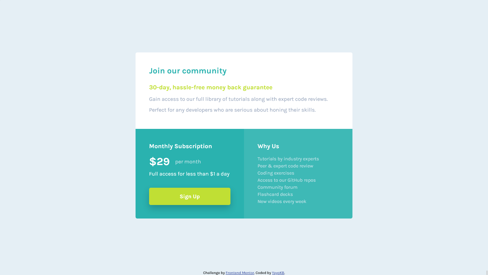

# Frontend Mentor - Single price grid component solution

This is a solution to the [Single price grid component challenge on Frontend Mentor](https://www.frontendmentor.io/challenges/single-price-grid-component-5ce41129d0ff452fec5abbbc). Frontend Mentor challenges help you improve your coding skills by building realistic projects.

## Table of contents

- [Overview](#overview)
  - [The challenge](#the-challenge)
  - [Screenshot](#screenshot)
  - [Links](#links)
- [My process](#my-process)
  - [Built with](#built-with)
  - [What I learned](#what-i-learned)
- [Author](#author)

## Overview

### The challenge

Users should be able to:

- View the optimal layout for the component depending on their device's screen size
- See a hover state on desktop for the Sign Up call-to-action

### Screenshot

### Links

- Solution URL: [GitHub](https://github.com/YayoKB/fem-single-price-grid-component)
- Live Site URL: [GitHub Pages](https://yayokb.github.io/fem-single-price-grid-component)

## My process

### Built with

- Semantic HTML5 markups
- CSS custom properties
- Flexbox
- CSS Grid
- Mobile-first workflow

### What I learned

Not much! I had to look up how to remove the bullet points for an unordered list though. 😔

## Author

- GitHub - [YayoKB](https://www.github.com/YayoKB)
- Frontend Mentor - [@YayoKB](https://www.frontendmentor.io/profile/YayoKB)
